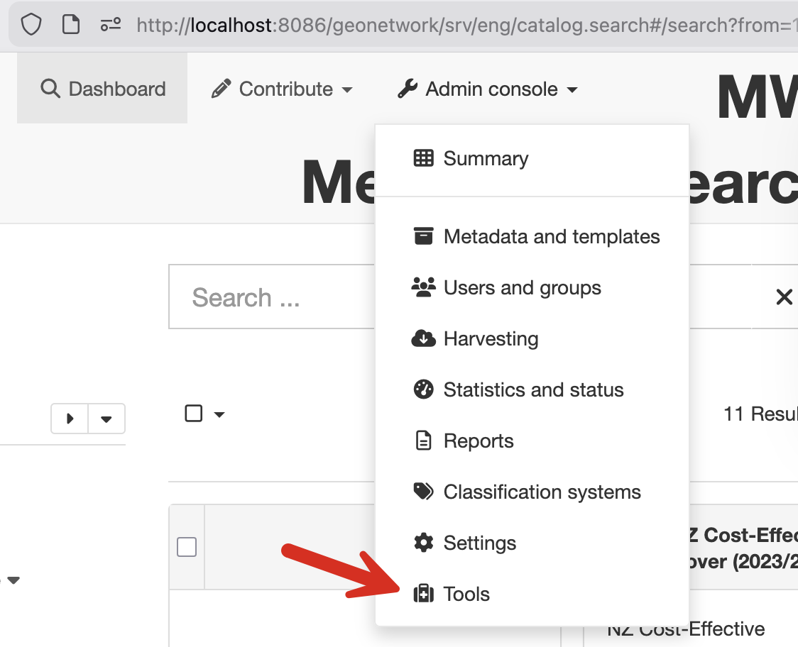
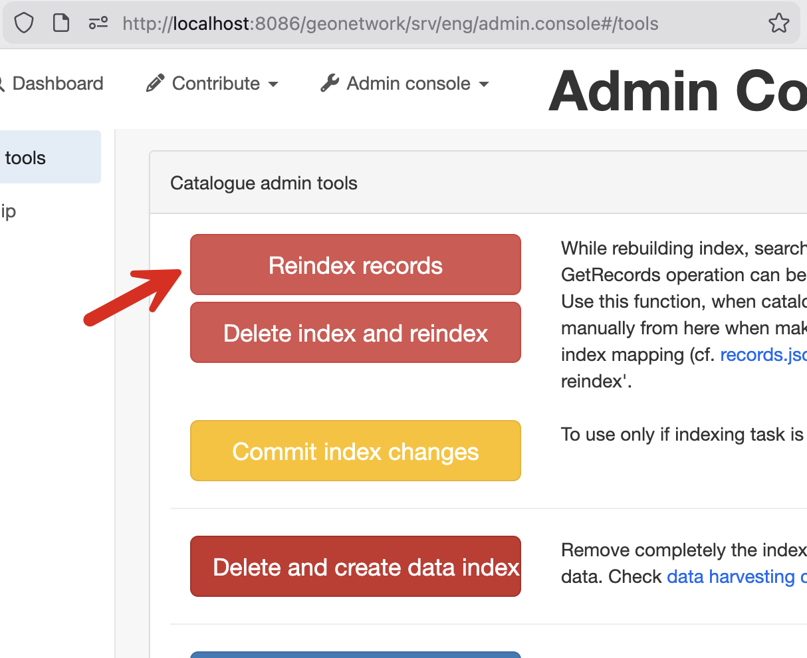

# MWLR Local Development Instructions

> **Note:** The default branch for this fork is `metaspace`, which contains MWLR-specific customizations.
>
> **Upstream:** This repository is forked from [OpenWork-NZ/core-geonetwork:gn-42-mwlr](https://github.com/OpenWork-NZ/core-geonetwork/tree/gn-42-mwlr).

---

## CI/CD Pipeline

When commits are pushed to the `metaspace` branch, the following automated process occurs:

1. **Build & Push** — GitHub Actions builds the Docker image and pushes it along with build metadata to Artifactory.
2. **Deploy to Dev** — The new image is automatically deployed to the **Dev** environment.
3. **Promote to Test** — Manual approval is required to promote the image to the **Test** environment.
4. **Promote to Production** — Manual approval is required to promote the image to **Production**.

### Environment URLs

| Environment | URL |
|-------------|-----|
| **Dev** | https://dev-metaspace.tak-k8s-nonprod.landcareresearch.co.nz |
| **Test** | https://test-metaspace.tak-k8s-nonprod.landcareresearch.co.nz |
| **Production** | https://metaspace.landcareresearch.co.nz |

---

## Local Development

## 1. Clone the repository

```sh
git clone git@github.com:manaakiwhenua/core-geonetwork.git
# or using HTTPS:
# git clone https://github.com/manaakiwhenua/core-geonetwork.git
```

## 2. Navigate to the project folder

```sh
cd core-geonetwork
```

## 3. Start the Docker containers

```sh
docker compose up -d
```

## 4. Restore test data

```sh
./restore-test-data.mwlr.sh
```

## 5. Follow the logs

```sh
docker compose logs --follow
```

## 6. Access GeoNetwork

Open your browser and visit: http://localhost:8086/geonetwork

## 7. Sign in

Use the default admin credentials:

- **Username:** `admin`
- **Password:** `admin`

## 8. Reindex the data

After restoring data, you need to reindex for search (and dashboad) to work properly.

### 8a. Click Admin Console


### 8b. Click Tools



### 8c. Click Reindex


